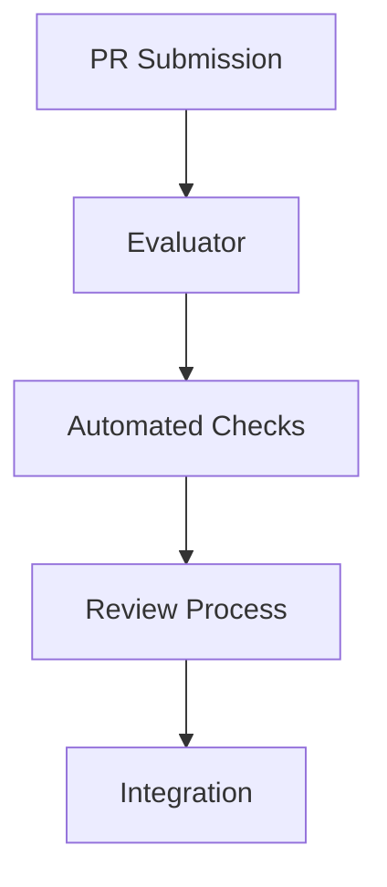
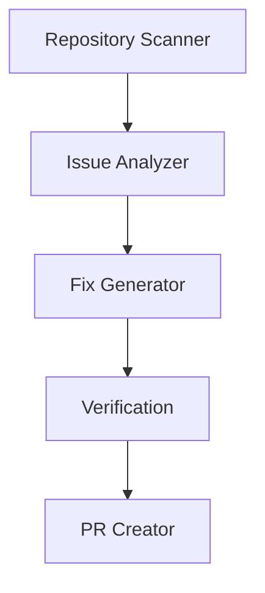

# OpenMender Architecture

## System Overview

### Bootstrap System

### Agent System

## Key Components

### Bootstrap Components
1. **Evaluator**
   - PR analysis
   - Code quality checks
   - Test verification

2. **Orchestrator**
   - Process management
   - Task scheduling
   - Resource allocation

### Agent Components
1. **Scanner**
   - Repository discovery
   - Issue identification
   - Pattern matching

2. **Generator**
   - Fix creation
   - Test generation
   - Documentation updates

## Data Flow
[To be developed]

## Security Considerations
[To be developed]

## Scaling Strategy
[To be developed]
