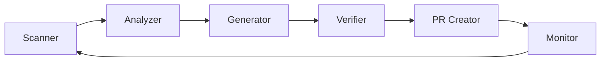

# OpenMender Agent

## Overview
The OpenMender Agent is the core system that will autonomously discover, analyze, and fix issues in open source repositories. This directory contains the components that will form the final distributed agent system.

## Architecture

## Components

### Scanner
- Repository discovery
- Code parsing
- Issue identification
- Rate limit management
- Repository filtering

### Analyzer
- Pattern matching
- Issue classification
- Complexity assessment
- Fix feasibility analysis
- Priority determination

### Generator
- Fix creation
- Test generation
- Documentation updates
- Commit message composition
- Change validation

### Verifier
- Test execution
- Security checks
- Performance impact analysis
- Breaking change detection
- Compatibility verification

## Current Status
🚧 **Under Development** 🚧

The agent is being built incrementally through the bootstrap system. Current components are placeholders for the eventual implementation.

## Design Principles

### Safety
- All changes must be verifiable
- No breaking changes
- Respect repository guidelines
- Conservative approach to modifications

### Intelligence
- Learn from successful fixes
- Adapt to project patterns
- Recognize context
- Improve over time

### Distribution
- Decentralized operation
- Resource sharing
- Load balancing
- Fault tolerance

### Respect
- Follow project guidelines
- Honor contribution rules
- Maintain code style
- Clear communication

### Community Preservation
- Respect "good first issue" and similar tags
- Focus on long-standing issues
- Avoid disrupting community growth opportunities
- Maintain configurable filters for issue selection

## Development Guidelines

### Adding New Components
1. Create detailed design document
2. Start with minimal implementation
3. Include comprehensive tests
4. Document all assumptions
5. Consider failure modes

### Testing Requirements
- Unit tests for all components
- Integration tests for workflows
- Performance benchmarks
- Security tests
- Failure scenario testing

### Documentation Standards
- Clear component interfaces
- Usage examples
- Configuration options
- Error handling
- Performance characteristics

## Configuration

### Required
- GitHub API credentials
- Repository access tokens
- Rate limit settings
- Operating parameters

### Optional
- Custom patterns
- Project preferences
- Distribution settings
- Monitoring config

## Deployment

### Prerequisites
- API access
- Computing resources
- Storage capacity
- Network bandwidth

### Setup
[To be developed]

### Monitoring
[To be developed]

### Resource Management
[To be developed]

## Contributing

### Areas Needing Help
1. Pattern recognition algorithms
2. Test generation strategies
3. Fix verification methods
4. Distribution mechanisms
5. Security improvements

### Getting Started
1. Review component documentation
2. Check existing issues
3. Join development discussions
4. Start with small improvements

## Future Roadmap

### Near Term
- [ ] Basic repository scanning
- [ ] Simple pattern matching
- [ ] Initial fix generation
- [ ] Basic verification

### Medium Term
- [ ] Advanced pattern recognition
- [ ] Complex fix generation
- [ ] Distributed operation
- [ ] Self-learning capabilities

### Long Term
- [ ] Autonomous operation
- [ ] Advanced AI integration
- [ ] Community-driven improvements
- [ ] Ecosystem integration

## Resources
- [Main Project Documentation](../README.md)
- [Architecture Overview](../docs/ARCHITECTURE.md)
- [Security Guidelines](../docs/SECURITY.md)
- [Contributing Guide](../CONTRIBUTING.md)

---

Note: This agent system is built gradually through the bootstrap system. Components will evolve from simple implementations to more sophisticated versions over time.
