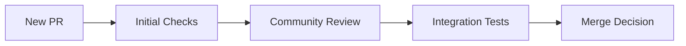

# OpenMender Bootstrap System

## Purpose
The bootstrap system is the self-improving framework that will ultimately build the OpenMender agent. It starts simple and grows more sophisticated through community contributions, gradually automating its own processes.

## Current State
The bootstrap system is in its initial phase. Currently, it consists of:
- Manual PR review processes
- Basic contribution guidelines
- Initial quality control criteria

## How It Works

### 1. PR Evaluation Flow


### 2. Automation Levels
The system progresses through different levels of automation:

- **Level 0** (Current)
  - Manual PR reviews
  - Human decision-making
  - Basic checks

- **Level 1** (Next Goal)
  - Automated style checks
  - Basic test automation
  - PR template validation

- **Level 2**
  - LLM-assisted PR review
  - Automated documentation checks
  - Impact analysis

- **Level 3**
  - Semi-autonomous decision making
  - Automated fix verification
  - Self-improvement proposals

## Directory Structure
```
bootstrap/
├── evaluator/           # PR evaluation logic
│   └── .gitkeep
├── orchestrator/        # Process management
│   └── .gitkeep
├── patterns/           # Known fix patterns
│   └── .gitkeep
└── tests/             # Test framework
    └── .gitkeep
```

## Current Priorities
1. Establishing basic PR evaluation criteria
2. Creating initial test frameworks
3. Documenting common patterns
4. Setting up automation pipelines

## How to Contribute

### For Developers
1. Check the [Issues](../issues) labeled with `bootstrap`
2. Follow the contribution guidelines
3. Start with small, well-defined improvements
4. Include tests and documentation

### For Reviewers
1. Help establish review criteria
2. Document decision patterns
3. Validate automation rules

## Quality Guidelines
- All changes must be traceable
- Changes should be atomic and focused
- Documentation is required
- Tests must be included
- Security implications must be considered

## Bootstrapping Phases

### Phase 1: Foundation
- [ ] Basic PR templates
- [ ] Initial review guidelines
- [ ] Test framework setup

### Phase 2: Automation Basics
- [ ] Automated style checking
- [ ] Basic test automation
- [ ] Documentation validators

### Phase 3: Intelligence
- [ ] LLM integration
- [ ] Pattern recognition
- [ ] Automated reviews

### Phase 4: Autonomy
- [ ] Self-improvement capabilities
- [ ] Automated decision making
- [ ] Quality assurance automation

## Development Guidelines
1. **Incremental Progress**
   - Small, verifiable changes
   - Clear documentation
   - Testable improvements

2. **Safety First**
   - No breaking changes
   - Careful permission management
   - Secure by default

3. **Community Focus**
   - Clear communication
   - Inclusive design
   - Transparent processes

## Getting Started
1. Review the current [Issues](../issues)
2. Check the [Projects](../projects) board
3. Join the discussion in [Discussions](../discussions)
4. Start with small contributions

## Resources
- [Main Project README](../README.md)
- [Contributing Guidelines](../CONTRIBUTING.md)
- [Code of Conduct](../CODE_OF_CONDUCT.md)
